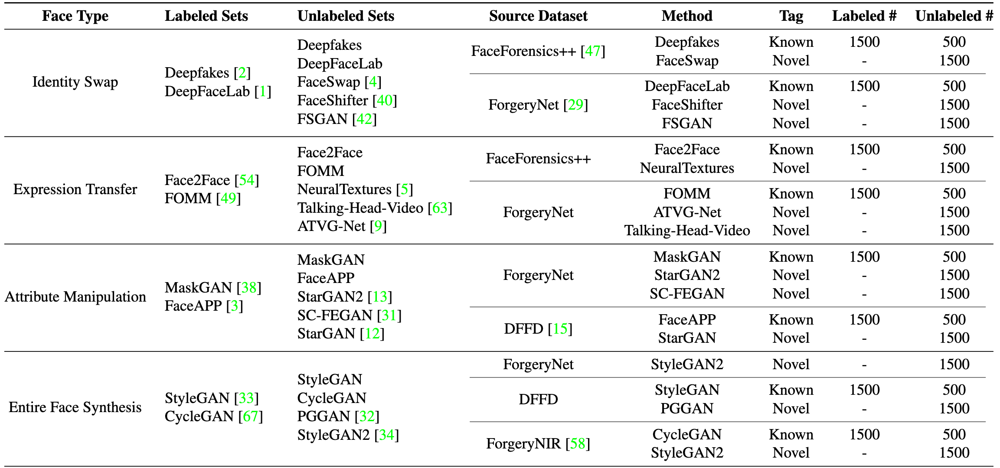
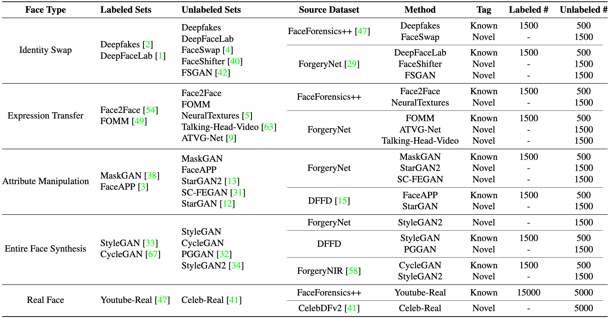

# Open-World DeepFake Attribution

> This repository is official implementation for Contrastive Pseudo Learning for Open-World DeepFake Attribution, ICCV 2023.


## Overview

The challenge in sourcing attribution for forgery faces has gained widespread attention due to the rapid development of generative techniques. While many recent works have taken essential steps on GAN-generated faces, more threatening attacks related to identity swapping or expression transferring are still overlooked. And the forgery traces hidden in unknown attacks from the open-world unlabeled faces still remain under-explored.
To push the related frontier research, we introduce a new benchmark called Open-World DeepFake Attribution (OW-DFA), which aims to evaluate attribution performance against various types of fake faces under open-world scenarios.
Meanwhile, we propose a novel framework named Contrastive Pseudo Learning (CPL) for the OW-DFA task through 1) introducing a Global-Local Voting module to guide the feature alignment of forged faces with different manipulated regions, 2) designing a Confidence-based Soft Pseudo-label strategy to mitigate the pseudo-noise caused by similar methods in unlabeled set. In addition, we extend the CPL framework with a multi-stage paradigm that leverages pre-train technique and iterative learning to further enhance traceability performance.
Extensive experiments verify the superiority of our proposed method on the OW-DFA and also demonstrate the interpretability of deepfake attribution task and its impact on improving the security of deepfake detection area.


## Dataset

- Prepare Deepfake Detection datasets

  |     Dataset     |                                 Paper                                 |                                                 Link                                                  |
  | :-------------: | :-------------------------------------------------------------------: | :---------------------------------------------------------------------------------------------------: |
  | FaceForensics++ |     FaceForensics++: Learning to Detect Manipulated Facial Images     |      [Paper](https://arxiv.org/abs/1901.08971) [Code](https://github.com/ondyari/FaceForensics)       |
  |    Celeb-DF     |  Celeb-DF: A Large-scale Challenging Dataset for DeepFake Forensics   | [Paper](https://arxiv.org/abs/1909.12962) [Code](https://github.com/yuezunli/celeb-deepfakeforensics) |
  |   ForgeryNet    | ForgeryNet: A Versatile Benchmark for Comprehensive Forgery Analysis  | [Paper](https://arxiv.org/abs/2103.05630) [Home](https://yinanhe.github.io/projects/forgerynet.html)  |
  |      DFFD       |             On the Detection of Digital Face Manipulation             |     [Paper](https://arxiv.org/abs/1910.01717) [Home](https://cvlab.cse.msu.edu/project-ffd.html)      |
  |   ForgeryNIR    | ForgeryNIR: Deep Face Forgery and Detection in Near-Infrared Scenario |  [Paper](https://ieeexplore.ieee.org/document/9693897) [Code](https://github.com/AEP-WYK/forgerynir)  |

- Download dataset and unzip data under the directory of `/Datasets/deepfakes_detection_datasets/`
- Process dataset with script `scripts/preprocess/create_academic_meta.ipynb`, and you will get the following structure:

  ```bash
  data/release
  ├── AttributeManipulation
  │   ├── FaceAPP
  │   │   └── DFFD
  │   ├── MaskGAN
  │   │   └── ForgeryNet
  │   ├── SC-FEGAN
  │   │   └── ForgeryNet
  │   ├── StarGAN
  │   │   └── DFFD
  │   └── StarGAN2
  │       └── ForgeryNet
  ├── EntireFaceSyncthesis
  │   ├── CycleGAN
  │   │   └── ForgeryNIR
  │   ├── PGGAN
  │   │   └── DFFD
  │   ├── StyleGAN
  │   │   └── DFFD
  │   └── StyleGAN2
  │       ├── ForgeryNet
  │       └── ForgeryNIR
  ├── ExpressionTransfer
  │   ├── ATVG-Net
  │   │   └── ForgeryNet
  │   ├── Face2Face
  │   │   └── faceforensics
  │   ├── FOMM
  │   │   └── ForgeryNet
  │   ├── NeuralTextures
  │   │   └── faceforensics
  │   └── Talking-Head-Video
  │       └── ForgeryNet
  ├── IdentitySwap
  │   ├── DeepFaceLab
  │   │   └── ForgeryNet
  │   ├── Deepfakes
  │   │   └── faceforensics
  │   ├── FaceShifter
  │   │   └── ForgeryNet
  │   ├── FaceSwap
  │   │   └── faceforensics
  │   └── FSGAN
  │       └── ForgeryNet
  ├── RealFace
  │   └── Real
  │       ├── CelebDF
  │       └── faceforensics
  ├── meta_data
  │   ├── Protocol1_openset_fake_large_merge_meta.csv
  │   ├── Protocol1_openset_fake_val_merge_meta.csv
  │   ├── Protocol2_openset_real_fake_large_merge_meta.csv
  │   └── Protocol2_openset_real_fake_val_merge_meta.csv
  └── shape_predictor_68_face_landmarks.dat
  ```

## Method


## Quick Start
**Step1.** Create a conda environment and activate it.
```bash
conda create --name owdfa python=3.9 -y
conda activate owdfa
```

**Step2.** Install the required python libraries.
```bash
cd OW-DFA
pip3 install -r requirements.txt
wandb offline
```

**Step3.** Train CPL model on OW-DFA dataset.

```bash
python3 -u -m torch.distributed.launch --nproc_per_node=1 --master_port 12345 \
  train.py -c configs/train.yaml
```

## Benchmark Evaluation

### Protocol-1: Fake



| **Method**        | **Known ACC** | **Novel ACC** | **Novel NMI** | **Novel ARI** | **All ACC** | **All NMI** | **All ARI** |
| ----------------- | ------------- | ------------- | ------------- | ------------- | ----------- | ----------- | ----------- |
| **Lower Bound**   | 99.96         | 40.96         | 46.43         | 24.05         | 46.90       | 63.18       | 36.35       |
| **Upper Bound**   | 98.21         | 95.36         | 91.57         | 92.14         | 96.68       | 93.94       | 93.59       |
| **DNA-Det**       | 74.47         | 34.82         | 44.22         | 19.35         | 34.99       | 55.55       | 24.89       |
| **Openworld-GAN** | 99.57         | 38.93         | 45.89         | 41.52         | 57.62       | 57.63       | 47.47       |
| **RankStats**     | 98.58         | 49.94         | 56.05         | 39.76         | 72.49       | 73.63       | 66.49       |
| **ORCA**          | 97.17         | 66.32         | 63.00         | 53.30         | 80.81       | 79.23       | 74.05       |
| **OpenLDN**       | 97.42         | 45.83         | 51.05         | 38.12         | 63.94       | 71.38       | 62.53       |
| **NACH**          | 96.88         | 70.13         | 67.10         | 56.63         | 82.61       | 81.98       | 76.41       |
| **CPL**           | 97.50         | 71.89         | 68.20         | 59.37         | 83.70       | 82.31       | 77.64       |

### Protocol-2: Real & Fake



| **Method**        | **Known ACC** | **Novel ACC** | **Novel NMI** | **Novel ARI** | **All ACC** | **All NMI** | **All ARI** |
| ----------------- | ------------- | ------------- | ------------- | ------------- | ----------- | ----------- | ----------- |
| **Lower Bound**   | 99.80         | 46.48         | 48.44         | 31.49         | 65.73       | 68.91       | 65.75       |
| **Upper Bound**   | 98.57         | 94.15         | 91.93         | 93.11         | 96.83       | 93.80       | 95.05       |
| **DNA-Det**       | 89.13         | 28.44         | 25.97         | 8.18          | 54.37       | 50.10       | 31.45       |
| **Openworld-GAN** | 99.60         | 46.68         | 53.66         | 45.82         | 69.26       | 58.60       | 61.09       |
| **RankStats**     | 96.84         | 45.26         | 52.44         | 30.17         | 74.39       | 72.21       | 81.66       |
| **ORCA**          | 95.04         | 53.81         | 60.01         | 38.91         | 78.99       | 78.04       | 83.80       |
| **OpenLDN**       | 96.40         | 42.23         | 50.66         | 28.86         | 71.19       | 73.26       | 82.51       |
| **NACH**          | 96.19         | 53.92         | 58.49         | 38.73         | 79.53       | 77.91       | 84.53       |
| **CPL**           | 95.64         | 59.92         | 63.90         | 43.75         | 81.10       | 80.23       | 84.99       |

## Citation
If you find this project useful in your research, please consider cite:
```bibtex
@inproceedings{sun2023contrastive,
  title={Contrastive Pseudo Learning for Open-World DeepFake Attribution},
  author={Sun, Zhimin and Chen, Shen and Yao, Taiping and Yin, Bangjie and Yi, Ran and Ding, Shouhong and Ma, Lizhuang},
  booktitle={Proceedings of the IEEE/CVF International Conference on Computer Vision},
  year={2023}
}
```
